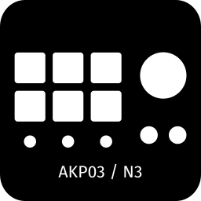

# OpenDeck Ajazz AKP03 / Mirabox N3 Plugin

An unofficial plugin for Mirabox N3-family devices

## OpenDeck version

Requires OpenDeck 2.5.0 or newer

## Supported devices

- Ajazz AKP03 (0300:1001)
- Ajazz AKP03E (0300:1002)
- Ajazz AKP03R (0300:1003)
- Ajazz AKP03E (rev. 2) (0300:3002)
- Ajazz AKP03R (rev. 2) (0300:3003)
- Mirabox N3 (6602:1000, 6602:1002, 6603:1002, 6603:1003)
- Soomfon Stream Controller SE (1500:3001)
- Mars Gaming MSD-TWO (0B00:1001)
- TreasLin N3 (5548:1001)
- Redragon Skyrider SS-551 (0200:2000)

## Platform support

- Linux: Guaranteed, if stuff breaks - I'll probably catch it before public release
- Mac: Best effort, no tests before release, things may break, but I probably have means to fix them
- Windows: Zero effort, no tests before release, if stuff breaks - too bad, it's up to you to contribute fixes

## Installation

1. Download an archive from [releases](https://github.com/4ndv/opendeck-akp03/releases)
2. In OpenDeck: Plugins -> Install from file
3. Download [udev rules](./40-opendeck-akp03.rules) and install them by copying into `/etc/udev/rules.d/` and running `sudo udevadm control --reload-rules`
4. Unplug and plug again the device, restart OpenDeck

## Adding new devices

Read [this wiki page](https://github.com/4ndv/opendeck-akp03/wiki/Adding-support-for-new-devices) for more information.

## Building

### Prerequisites

You'll need:

- A Linux OS of some sort
- Rust 1.87 and up with `x86_64-unknown-linux-gnu` and `x86_64-pc-windows-gnu` targets installed
- gcc with Windows support
- Docker
- [just](https://just.systems)

On Arch Linux:

```sh
sudo pacman -S just mingw-w64-gcc mingw-w64-binutils
```

Adding rust targets:

```sh
rustup target add x86_64-pc-windows-gnu
rustup target add x86_64-unknown-linux-gnu
```

### Building a release package

```sh
$ just package
```

## Acknowledgments

This plugin is heavily based on work by contributors of [elgato-streamdeck](https://github.com/streamduck-org/elgato-streamdeck) crate
